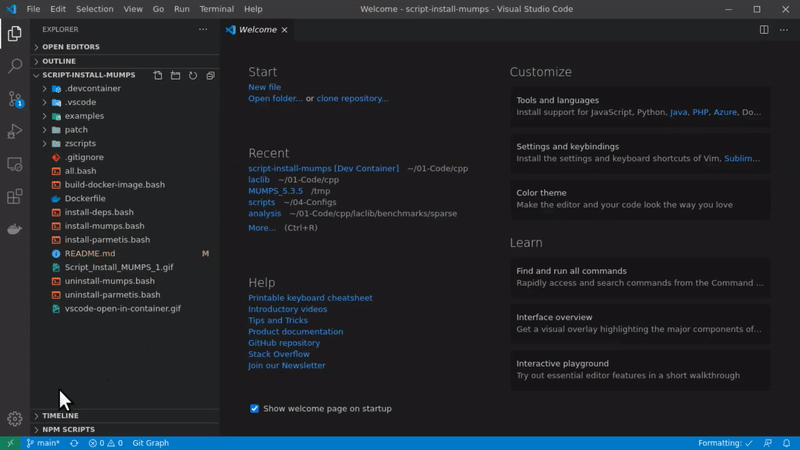

# Linear systems with Intel DSS and matrix market

This code solves linear systems with Intel DSS solver and large matrices from Matrix Market.

You may install Intel MKL locally or use a Docker container as explained in the next section.

## Local Installation

**1 Install Intel MKL**

```bash
bash scripts/install-intel-mkl-linux.bash
```

**2 Download some Matrix Market Files**

```bash
bash scripts/download-from-matrix-market.bash
```

**3 Run Example**

```bash
bash ./all.bash
```

## Using Docker

You may use an existent image from `cpmech` or build the Docker image yourself (see script `docker-build-image.bash`).

**1 Reopen this folder in a container**



**2 Download some Matrix Market Files**

```bash
bash scripts/download-from-matrix-market.bash
```

**3 Run Example**

```bash
bash ./all.bash
```
